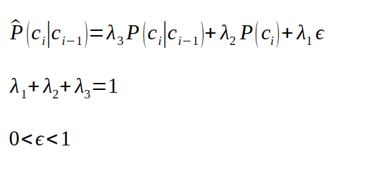
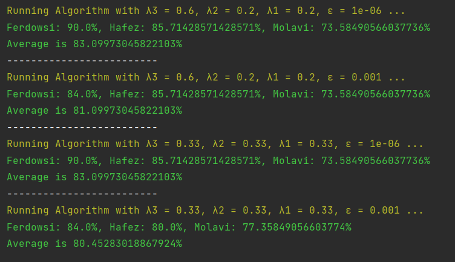

# Poet detection using NLP
In this project. An NLP approach is implemented to detect the poet of poetry by giving a piece of verse.

To do so, we use three train datasets, each one connected to one of Iran's most famous poets. Every line in each.txt file is a part of their poetry without any particular sequence.

## Steps
### 1. Making a dictionary based on the training data
We may achieve this by extracting each word from the training data and counting them all. Then we set a threshold so that any term that appears fewer than two times is eliminated and the remaining words are considered the dictionary.

### 2. Creating language model for each poet.
In this step, we build a unigram and bigram language model for each poet. The backoff model is then used as a smoothing technique, as follows:

### 3. Calculating the probability of verses on the test set according to the created language models.
Last but not least, for each language model we created in the step 2, we calculate the probability of the given verse on the test set. To do that, for each verse, we calculate three probabilities, one for each poet. Finally, the poet with the greatest probability is the predicted poet.

*Note that in the test set, we have three labels each has a one-to-one relationship with the poet:
* 1: Ferdowsi
* 2: Hafez
* 3: Molavi

## Results
After running it with different parameters, we may reach the following result:

According to the aforementioned result, it is apparent that when λ3, λ2 and λ1 have significant, immediate and minor values, respectively, the outcome is better. One justification is that λ3 is the coefficient for bigram. Hence, it accounts for the relation between two subsequent words and a poet's use of two terms in succession is more distinctive than utilizing just one word in a poem.

Another noteworthy point is that these coefficients have a threshold. Simply put, imagine we assign λ3=0.95, λ2=0.3 and λ1=0.2 as the coefficients of the back-off model. Since the number of zero probabilities in a bigram is so much, in such circumstances, we only have coefficients for unigram and ε. The model, however, fails to detect the differences since we provided tiny values to these coefficients.

Finally, for the comparison between the values of ε, one possible interpretation is that the less value we assign to this term, the higher accuracy we gain. The reason is that ε is only efficient that unigram and bigram are both zero. In such cases, ε plays a critical role; otherwise, the probability becomes zero. Nevertheless, since bigram and unigram usually have tiny probability, by assigning a considerable value to the ε, the effect of this term would be more significant and, consequently, we reach less accuracy.
  

